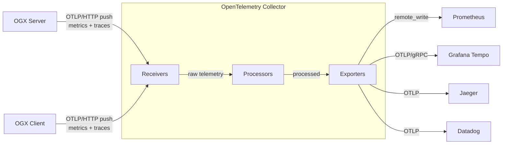
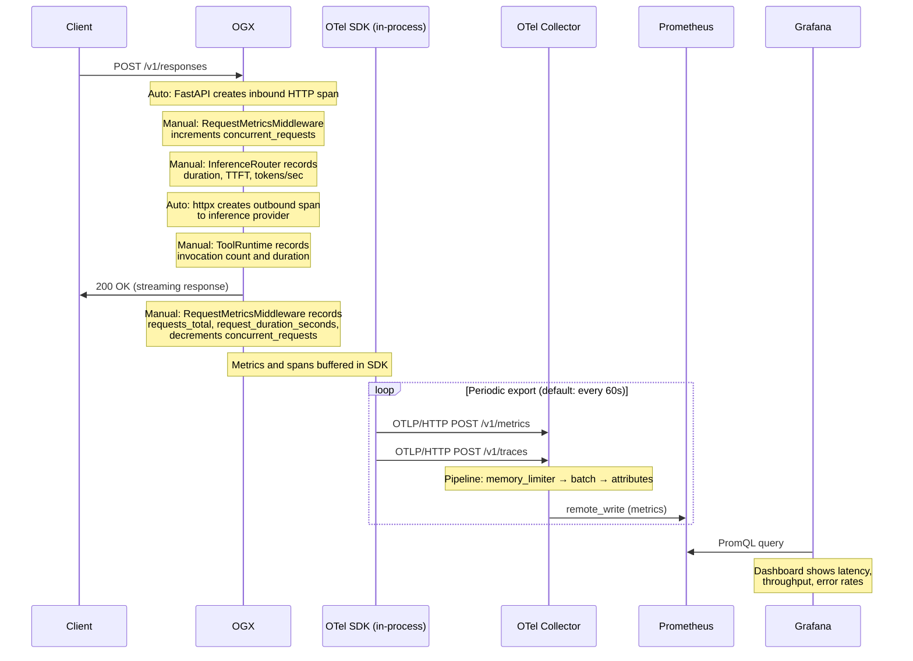

Running an LLM application in production is nothing like running a traditional web service. Responses are non-deterministic. Latency swings wildly with model size and token count. And failures are often silent — a tool call that returns garbage still comes back as a 200 OK. You can stare at your HTTP dashboard all day and have no idea that half your users are getting bad answers.

We recently shipped built-in observability for OGX, powered by [OpenTelemetry](https://opentelemetry.io/). Three environment variables, zero code changes, and you get metrics and traces from every layer — HTTP requests, inference calls, tool invocations, vector store operations, all the way down.

This post explains the architecture behind it, walks through a hands-on tutorial, and shows what you can actually see once it's running.

{/*truncate*/}

## Why Observability Matters for LLM Applications

If you've operated traditional services, you know the drill: uptime checks, error rates, latency percentiles. LLM applications need all of that, plus a whole category of signals that don't exist in conventional backends.

**Latency is multi-dimensional.** A single `/v1/responses` call might fan out to an inference provider, three tool calls, and two vector store queries. Knowing the overall P99 is 4 seconds doesn't help you — you need to know which leg is slow.

**Token economics drive cost.** Without tracking tokens-per-second and usage patterns across models and providers, capacity planning is guesswork.

**Time-to-first-token (TTFT) defines user experience.** A streaming response with a 5-second TTFT feels broken to the user, even if total latency is fine.

**Silent failures are common.** A tool invocation that times out, a vector search that returns zero results, a safety shield that blocks unexpectedly — none of these produce HTTP errors, but all degrade quality. You won't find them in your access logs.

**Provider comparison requires data.** When you run multiple inference backends (vLLM, Ollama, OpenAI), you need apples-to-apples latency and reliability numbers, not vibes.

## How We Instrumented OGX

We chose [OpenTelemetry](https://opentelemetry.io/) (OTel) — the CNCF's vendor-neutral standard for metrics, traces, and logs. The practical upside: you export to Prometheus, Grafana, Jaeger, Datadog, or any OTLP-compatible backend, and you can switch without touching application code.

The instrumentation has two layers that work together. Both feed into the OpenTelemetry SDK, which batches and exports signals to the Collector via OTLP.

### Auto instrumentation: the infrastructure view

Launch OGX with the `opentelemetry-instrument` CLI wrapper and you get — with zero code changes:

- Inbound HTTP spans and metrics from FastAPI (every API request)
- Outbound HTTP spans and metrics from httpx (calls to inference providers)
- Database query spans from SQLAlchemy and asyncpg
- GenAI call spans from OTel ecosystem packages for OpenAI, Bedrock, Vertex AI, etc. — model name, token counts, finish reasons, all captured at the SDK level

This covers the "infrastructure view": request flow, provider latency, GenAI call details, database performance.

### Manual instrumentation: the application view

Auto instrumentation doesn't know about OGX's domain concepts. So we added manual instrumentation directly in the routers and middleware to capture:

- **API request metrics** — total count, duration histogram, concurrent request gauge
- **Inference metrics** — end-to-end duration, TTFT, tokens-per-second
- **Vector IO metrics** — insert, query, and delete counts with duration
- **Tool runtime metrics** — invocation count and duration by tool name and status
- **Safety spans** — shield evaluation traces with attribute context

The two layers are complementary. Auto instrumentation tells you what's happening at the network and SDK level; manual instrumentation tells you what's happening at the application level. As a user, you don't need to care about any of this — just launch with `opentelemetry-instrument` and everything lights up.

## The OpenTelemetry Collector

Between OGX and your observability backends sits the [OpenTelemetry Collector](https://opentelemetry.io/docs/collector/). It receives OTLP data, processes it, and fans out to one or more destinations.



The pipeline has three stages:

**Receivers** define how data enters. OGX pushes to the OTLP receiver on port 4318 (HTTP) or 4317 (gRPC). You can run additional receivers in parallel — for example, a Prometheus scrape receiver for other services in your infrastructure.

**Processors** transform data in flight. The ones that matter for production: `batch` (groups telemetry for efficient network transfer), `memory_limiter` (drops data under memory pressure instead of OOM-ing), `attributes` (inject labels like `environment=production`), and `filter` (drop noise like health check spans). They run in the order you define them — a typical chain is `memory_limiter → batch → attributes`.

**Exporters** send data to backends. `prometheusremotewrite` for Prometheus-compatible stores, `otlp` for Jaeger/Tempo/Datadog, `debug` for stdout during development. A single Collector can export metrics to Prometheus for dashboarding AND to Datadog for alerting simultaneously.

The key benefit: OGX only speaks OTLP. The Collector handles format conversion, retries, and routing. Swap backends without changing a line of application code.

## End-to-End Data Flow

Here's what happens when a request comes in:



Two things worth noting. First, recording is non-blocking — metrics write to an in-memory buffer, so they add negligible latency to the request path. Second, export is batched — the SDK flushes every 60 seconds by default, which means dashboards have up to a minute of delay, but request handling is never blocked by network I/O to the Collector.

## Hands-On Tutorial

Let's set everything up. By the end you'll have distributed tracing in Jaeger, metrics in Prometheus, and pre-built dashboards in Grafana.

### Step 0: Prerequisites

You'll need:

- **Docker** or **Podman** for running the observability stack
- A working **OGX** installation with `uv`

Clone the repo if you haven't:

```bash
git clone https://github.com/ogx-ai/ogx.git
cd ogx
```

The telemetry configs live in [`scripts/telemetry/`](https://github.com/ogx-ai/ogx/tree/main/scripts/telemetry):

| File | What it does |
|---|---|
| `setup_telemetry.sh` | Starts all telemetry services |
| `otel-collector-config.yaml` | Collector pipeline config |
| `prometheus.yml` | Prometheus scrape config |
| `grafana-datasources.yaml` | Grafana datasource provisioning |
| `grafana-dashboards.yaml` | Grafana dashboard provisioning |
| `ogx-dashboard.json` | Pre-built Grafana dashboard |

### Step 1: Deploy the Observability Stack

One script brings up Jaeger, the OTel Collector, Prometheus, and Grafana:

```bash
# Auto-detect container runtime (podman or docker)
./scripts/telemetry/setup_telemetry.sh

# Or specify explicitly
./scripts/telemetry/setup_telemetry.sh --container docker
```

This creates a `llama-telemetry` container network, starts all four services, and provisions Grafana with a pre-built dashboard.

### Step 2: Install OpenTelemetry Packages

```bash
uv pip install opentelemetry-distro opentelemetry-exporter-otlp
uv run opentelemetry-bootstrap -a requirements | uv pip install --requirement -
```

`opentelemetry-bootstrap` detects your installed libraries (FastAPI, httpx, SQLAlchemy, OpenAI SDK, etc.) and installs the matching instrumentation packages automatically.

### Step 3: Launch the Server

Set three environment variables and wrap the launch command with `opentelemetry-instrument`:

```bash
export OTEL_EXPORTER_OTLP_ENDPOINT=http://localhost:4318
export OTEL_EXPORTER_OTLP_PROTOCOL=http/protobuf
export OTEL_SERVICE_NAME=ogx-server

uv run opentelemetry-instrument ogx stack run starter
```

That's it. When `OTEL_EXPORTER_OTLP_ENDPOINT` is set, both auto and manual instrumentation activate. When it's not set, metrics are recorded in memory but never exported — no overhead, no errors.

| Variable | Purpose | Example |
|----------|---------|---------|
| `OTEL_EXPORTER_OTLP_ENDPOINT` | Collector endpoint | `http://localhost:4318` |
| `OTEL_EXPORTER_OTLP_PROTOCOL` | Transport protocol | `http/protobuf` |
| `OTEL_SERVICE_NAME` | Service name in telemetry | `ogx-server` |
| `OTEL_METRIC_EXPORT_INTERVAL` | Export interval (ms) | `60000` (default) |

> **Tip**: If you see duplicate database traces, set `OTEL_PYTHON_DISABLED_INSTRUMENTATIONS="sqlite3,asyncpg"` to disable overlapping instrumentors.

### Step 4: Launch Your Client

To get end-to-end distributed tracing, launch your client the same way:

```bash
export OTEL_EXPORTER_OTLP_ENDPOINT=http://localhost:4318
export OTEL_EXPORTER_OTLP_PROTOCOL=http/protobuf
export OTEL_SERVICE_NAME=my-ogx-app

opentelemetry-instrument python my_app.py
```

A minimal example:

```python
from openai import OpenAI

client = OpenAI(api_key="fake", base_url="http://localhost:8321/v1/")

response = client.chat.completions.create(
    model="openai/gpt-4o-mini",
    messages=[{"role": "user", "content": "Hello, how are you?"}],
)
print(response.choices[0].message.content)
```

With `opentelemetry-instrument`, this client automatically generates GenAI spans (model, token counts, finish reasons) and HTTP spans, all correlated with server-side traces via W3C trace context propagation.

By default, message content (prompts, outputs, tool arguments) is **not** captured for privacy. To enable content capture for debugging:

```bash
OTEL_INSTRUMENTATION_GENAI_CAPTURE_MESSAGE_CONTENT=true \
opentelemetry-instrument python my_app.py
```

Captured content appears as log events (`gen_ai.user.message`, `gen_ai.choice`) correlated with trace spans via `trace_id`/`span_id`. The spans themselves carry structured metadata (model, token usage, latency) but not the raw text.

### Step 5: Explore the Data

Once traffic is flowing:

| Service | URL | Credentials |
|---|---|---|
| **Jaeger** (traces) | [http://localhost:16686](http://localhost:16686) | N/A |
| **Prometheus** (metrics) | [http://localhost:9090](http://localhost:9090) | N/A |
| **Grafana** (dashboards) | [http://localhost:3000](http://localhost:3000) | admin / admin |

#### Jaeger: Distributed Traces

Select the `ogx-server` or `my-ogx-app` service to see request traces. Each trace shows the full request lifecycle — client HTTP call → FastAPI handler → inference provider call → database operations. You can pinpoint exactly where time is spent.


#### Prometheus: Metrics Queries

Some useful PromQL to get you started:

| What you want to know | PromQL |
|---|---|
| Input token usage by model | `sum by(gen_ai_request_model) (ogx_gen_ai_client_token_usage_sum{gen_ai_token_type="input"})` |
| Output token usage by model | `sum by(gen_ai_request_model) (ogx_gen_ai_client_token_usage_sum{gen_ai_token_type="output"})` |
| P95 HTTP server latency | `histogram_quantile(0.95, rate(ogx_http_server_duration_milliseconds_bucket[5m]))` |
| P99 inference duration | `histogram_quantile(0.99, rate(ogx_inference_duration_seconds_bucket[5m]))` |
| P95 TTFT by model | `histogram_quantile(0.95, rate(ogx_inference_time_to_first_token_seconds_bucket[5m]))` |
| Median tokens/sec by provider | `histogram_quantile(0.5, rate(ogx_inference_tokens_per_second_bucket[5m]))` |
| Tool invocation errors | `rate(ogx_tool_runtime_invocations_total{status="error"}[5m])` |


#### Grafana: Pre-built Dashboard

A **OGX** dashboard is automatically provisioned with panels for prompt tokens, completion tokens, P95/P99 HTTP duration, and request volume. It's a starting point — extend it with the PromQL queries above for inference-specific views.


### Step 6: Set Up Alerts

With metrics in Prometheus, you can set up alerts for the things that actually page you at 3 AM:

- **High latency**: P99 inference duration > 10s sustained for 5 minutes
- **Error rate spike**: Error rate > 5% over a 5-minute window
- **Provider down**: Zero successful requests to a provider for 2 minutes
- **Capacity warning**: Concurrent requests consistently above threshold

### Cleanup

```bash
docker stop jaeger otel-collector prometheus grafana
docker rm jaeger otel-collector prometheus grafana
docker network rm llama-telemetry
```

## What's Next

The instrumentation is in place, and we're planning to expand it. If you have ideas for metrics that would help you operate OGX in production or if you've built interesting dashboards on top of what's there, we'd love to hear about it. Open an issue or check the [contributing guide](https://github.com/ogx-ai/ogx/blob/main/CONTRIBUTING.md).
