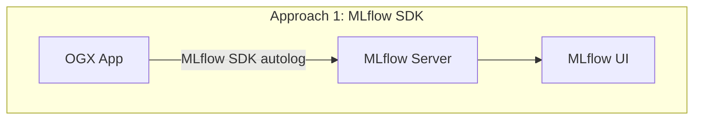
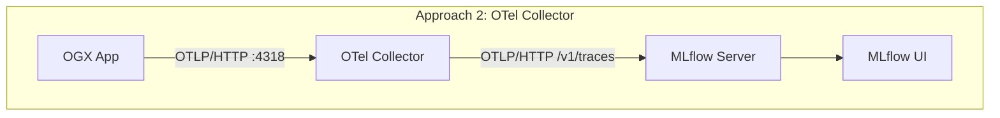
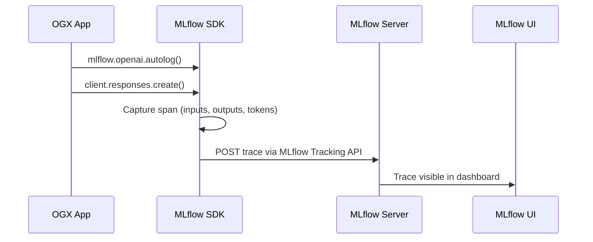
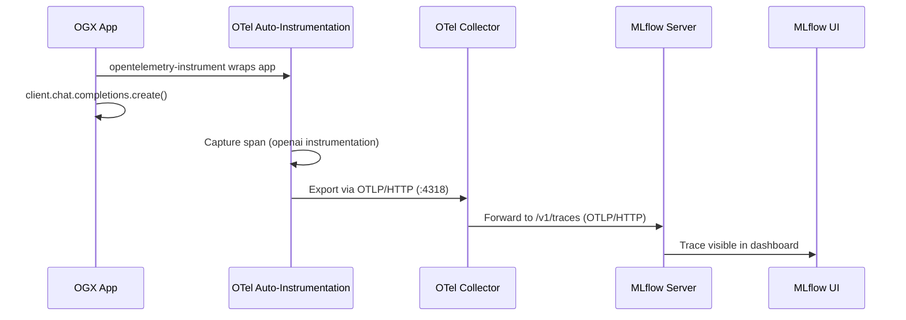
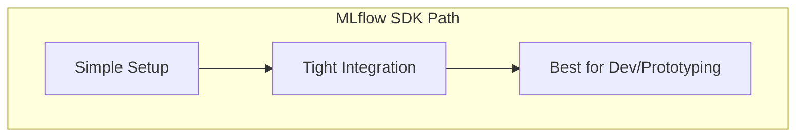
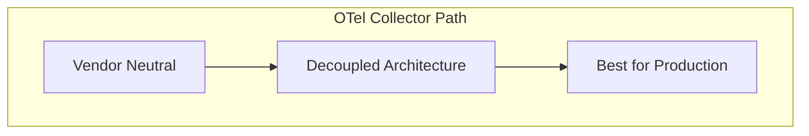

As LLM-powered applications grow in complexity, observability becomes essential. You need to understand what your application is doing — what prompts are being sent, what responses come back, how long each call takes, and how many tokens are consumed. [MLflow](https://mlflow.org/) provides a powerful tracing framework that captures all of this, which can be integrated with [ogx](https://github.com/ogx-ai/ogx) for observability.

In this post, we'll walk through two approaches for exporting OGX traces into MLflow:

1. **MLflow SDK** — Direct instrumentation using MLflow's built-in tracing and autologging
2. **OTel Collector** — Decoupled telemetry pipeline using OpenTelemetry auto-instrumentation and an OTel Collector as the intermediary

By the end, you'll understand when to use each approach and how to set them up.

## MLflow Tracing: A Quick Overview

MLflow is an open-source platform for managing the ML lifecycle. Starting with version 2.14, MLflow introduced **GenAI tracing** — a first-class feature for capturing LLM interactions including:

- **Traces and Spans**: Hierarchical representation of operations (API calls, tool invocations, chain steps)
- **Token Usage & Latency**: Automatic capture of input/output tokens and response times
- **Input/Output Logging**: Full request and response payloads for debugging
- **Web UI**: A built-in dashboard for exploring, filtering, and analyzing traces

MLflow also supports ingesting traces via the **OpenTelemetry (OTLP) protocol** at its `/v1/traces` endpoint, which opens the door to vendor-neutral instrumentation, more on that in the OTel Collector section.

## OGX and Its OpenAI-Compatible API

OGX provides an OpenAI-compatible API, meaning any tooling that works with OpenAI's chat completions API or responses API also works with OGX. This is key for tracing, we can leverage existing OpenAI instrumentation libraries (both MLflow's `openai.autolog()` and OpenTelemetry's `opentelemetry-instrumentation-openai-v2`) to capture traces without writing custom code.

## Architecture Overview

Before diving into the details, here's a high-level view of both approaches:





## Prerequisites

For both approaches, you'll need:

- **Python 3.10+**
- **A running OGX server** (e.g., at `http://localhost:8321`)
- **MLflow >= 3.10** with GenAI extras:

```bash
pip install "mlflow[genai]>=3.10" "openai>=2.20.0"
```

### Start the MLflow Tracking Server

Launch a local MLflow server with SQLite as the backend store:

```bash
mlflow server \
  --backend-store-uri sqlite:///mlflow.db \
  --default-artifact-root ./mlruns \
  --host 0.0.0.0 --port 5000
```

The MLflow UI will be available at [http://localhost:5000](http://localhost:5000).

## Approach 1: Tracing via MLflow SDK

This approach uses MLflow's native tracing SDK to capture and export traces directly to the MLflow server. It's the simplest way to get started.



### Step 1: Instrument Your Code

Add MLflow tracing to your OGX client code. The example below uses the [Responses API](https://platform.openai.com/docs/api-reference/responses) (`client.responses.create`), which is the recommended way to interact with OGX:

```python
import mlflow
import mlflow.tracing as mlflow_tracing
from openai import OpenAI

# Configure MLflow
mlflow.set_tracking_uri("http://localhost:5000")
mlflow.set_experiment("OGX Demo")

# Enable tracing and OpenAI autologging
mlflow_tracing.enable()
mlflow.openai.autolog()

# Create an OpenAI-compatible client pointing to OGX
client = OpenAI(
    base_url="http://localhost:8321/v1",
    api_key="fake",
)

response = client.responses.create(
    model="meta-llama/Llama-3.1-8B-Instruct",
    input="Give a one-sentence description of OGX.",
)
print(response.output_text)
```

MLflow's `openai.autolog()` automatically captures every `client.responses.create()` call as a trace, including inputs, outputs, token usage, and latency — with zero additional instrumentation code.

### Step 2: Run the Application

```bash
MLFLOW_TRACKING_URI=http://localhost:5000 \
python your_app.py
```

### Step 3: View Traces in MLflow

Open [http://localhost:5000](http://localhost:5000), navigate to your experiment ("OGX Demo"), and click the **Traces** tab. You'll see each request with:

- Full input/output payloads
- Token usage (input, output, total)
- Latency breakdown
- Span hierarchy


### Pros and Cons

| Aspect | Details |
|---|---|
| **Simplicity** | Minimal setup — just a few lines of Python |
| **Rich data** | MLflow autolog captures detailed OpenAI-specific metadata |
| **Coupling** | Application code depends on `mlflow` package |
| **Flexibility** | Traces go directly to MLflow — no intermediary routing or fan-out |

## Approach 2: Tracing via OTel Collector

This approach decouples instrumentation from the trace backend. The application uses **OpenTelemetry auto-instrumentation** to emit spans, which flow through an **OTel Collector** before being forwarded to MLflow's OTLP endpoint.



### Step 1: Install OpenTelemetry Dependencies

```bash
pip install opentelemetry-api \
            opentelemetry-sdk \
            opentelemetry-exporter-otlp \
            opentelemetry-instrumentation-openai
```

### Step 2: Configure the OTel Collector

Create an `otel-collector-config.yaml`:

```yaml
receivers:
  otlp:
    protocols:
      http:
        endpoint: 0.0.0.0:4318

exporters:
  otlphttp/mlflow:
    endpoint: http://host.docker.internal:5000
    traces_endpoint: /v1/traces
    tls:
      insecure: true
    headers:
      x-mlflow-experiment-id: "1"

processors:
  batch:
    timeout: 5s

service:
  pipelines:
    traces:
      receivers: [otlp]
      processors: [batch]
      exporters: [otlphttp/mlflow]
```

Key configuration points:

- **`receivers.otlp`**: Accepts OTLP data on port 4318 (HTTP)
- **`exporters.otlphttp/mlflow`**: Forwards traces to MLflow's `/v1/traces` OTLP endpoint
- **`x-mlflow-experiment-id`**: Determines which MLflow experiment receives the traces
- **`host.docker.internal`**: Allows the containerized collector to reach the host machine's MLflow server

### Step 3: Run the OTel Collector

```bash
docker run -d \
  --name otel-collector \
  -p 4318:4318 \
  -v $(pwd)/otel-collector-config.yaml:/etc/otelcol-contrib/config.yaml \
  otel/opentelemetry-collector-contrib:0.143.1
```

### Step 4: Run the Application with OTel Instrumentation

The key difference here: we use `opentelemetry-instrument` to wrap the application, and we **disable** MLflow's built-in tracing to avoid double-writing:

```bash
MLFLOW_ENABLE_TRACING=0 \
OTEL_EXPORTER_OTLP_ENDPOINT=http://localhost:4318 \
OTEL_EXPORTER_OTLP_PROTOCOL=http/protobuf \
OTEL_SERVICE_NAME=ogx-app \
opentelemetry-instrument python your_app.py
```

Note that the application code itself does **not** need any MLflow imports for tracing. The OpenTelemetry auto-instrumentation handles span creation, and the collector handles routing.

### Step 5: Verify Traces

Check that traces are flowing into MLflow:

```bash
# Via CLI
MLFLOW_TRACKING_URI=http://localhost:5000 \
mlflow traces search --experiment-id 1

# Or check the database directly
sqlite3 mlflow.db "SELECT count(*) FROM trace_info;"
```

Then open the MLflow UI at [http://localhost:5000](http://localhost:5000) to explore the traces visually.


### Pros and Cons

| Aspect | Details |
|---|---|
| **Decoupling** | App has no MLflow SDK dependency — only standard OTel |
| **Fan-out** | Collector can export to multiple backends simultaneously (e.g., Jaeger + MLflow) |
| **Production-ready** | OTel Collector provides buffering, retry, and batching |
| **Complexity** | Requires running and configuring an additional service (the collector) |
| **Data richness** | OTel OpenAI instrumentation may capture different fields than MLflow autolog |

### Responses API Support

**Note:** OpenTelemetry auto-instrumentation for the Responses API is not yet available upstream. Progress is tracked in [ogx/ogx#5192](https://github.com/ogx-ai/ogx/issues/5192). In the meantime, Approach 1 (MLflow SDK) fully supports tracing Responses API calls via `mlflow.openai.autolog()`.

## Approach Comparison





| Criteria | MLflow SDK | OTel Collector |
|---|---|---|
| **Setup complexity** | Low — a few lines of code | Medium — collector config + container |
| **Code coupling** | Coupled to `mlflow` package | No MLflow dependency in app code |
| **Multi-backend support** | MLflow only | Fan-out to any OTLP-compatible backend |
| **Buffering & retry** | Basic (in-process) | Production-grade (collector handles it) |
| **Best for** | Development, prototyping, quick experiments | Production deployments, multi-tool observability stacks |
| **Instrumentation** | `mlflow.openai.autolog()` | `opentelemetry-instrument` + OTel OpenAI plugin |

## Bonus: Tracing the OGX Server Itself

Both approaches above trace the **client side** — the application making calls to OGX. But you can also trace the **OGX server** using the OTel approach:

```bash
OTEL_EXPORTER_OTLP_TRACES_ENDPOINT=http://localhost:5000/v1/traces \
OTEL_EXPORTER_OTLP_TRACES_PROTOCOL=http/protobuf \
OTEL_EXPORTER_OTLP_TRACES_HEADERS="x-mlflow-experiment-id=1" \
OTEL_SERVICE_NAME=ogx-server \
opentelemetry-instrument ogx stack run starter
```

This gives you end-to-end visibility: client-side spans showing the request lifecycle, and server-side spans showing internal OGX processing.

> **Important:** MLflow SDK tracing only instruments the **client side**. The OGX server itself is not instrumented by MLflow, so server-side spans (inference routing, tool execution, etc.) are only visible through OpenTelemetry auto-instrumentation (Approach 2).
>
## Common Gotchas

1. **MLflow OTLP endpoint path**: Use `/v1/traces`, not `/api/2.0/otlp/v1/traces` (the latter returns 404 in MLflow 3.10+).

2. **Double-writing**: If you enable both MLflow autolog and OTel instrumentation, traces may be written twice. Set `MLFLOW_ENABLE_TRACING=0` when using the OTel path.

3. **Missing spans with OTel**: The `opentelemetry-instrument` wrapper is required — simply setting `OTEL_*` environment variables without it won't produce any spans because no instrumentation is active.

4. **Docker networking**: When running the OTel Collector in Docker, use `host.docker.internal` to reach services on the host machine.

5. **Time range in UI**: If the MLflow UI looks empty, check the time range filter — it may default to a narrow window that excludes your traces.

## Conclusion

Both approaches get your OGX traces into MLflow, but they serve different needs:

- **Start with the MLflow SDK** when you want quick, low-friction observability during development. A few lines of code and you're tracing.
- **Move to the OTel Collector** when you need production-grade telemetry infrastructure — decoupled from your application, with the ability to fan out to multiple observability backends.

The good news: since OGX exposes an OpenAI-compatible API, both paths leverage existing, well-maintained instrumentation libraries. You're not writing custom tracing code — you're plugging into an ecosystem.

## Quick Start With Containers

A pending PR, [feat: add MLflow support for OGX](https://github.com/ogx-ai/ogx/pull/5409), will let you run OGX alongside MLflow, Grafana, and Prometheus in containers with a single command. Once that PR lands, use the [telemetry scripts](https://github.com/ogx-ai/ogx/tree/main/scripts/telemetry) in the OGX repository for the full walkthrough.

## References

- [MLflow Tracing Documentation](https://mlflow.org/docs/latest/llms/tracing/index.html)
- [OpenTelemetry Collector Documentation](https://opentelemetry.io/docs/collector/)
- [OpenTelemetry OpenAI Instrumentation](https://github.com/open-telemetry/opentelemetry-python-contrib)
