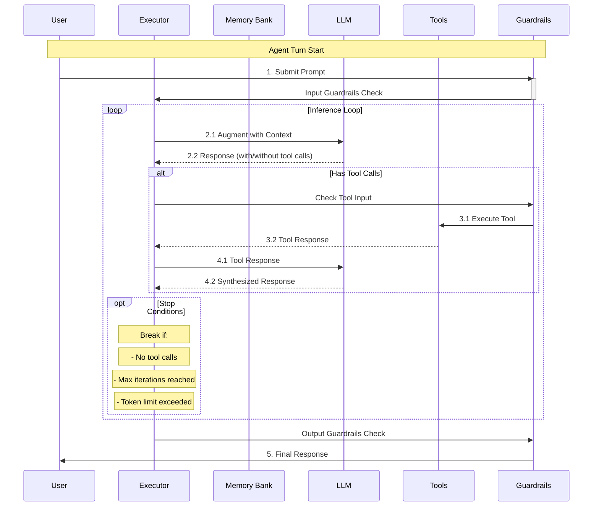

import Tabs from '@theme/Tabs';
import TabItem from '@theme/TabItem';

# Agent Execution Loop

Agents are the heart of OGX applications. They combine inference, memory, guardrails, and tool usage into coherent workflows. At its core, an agent follows a sophisticated execution loop that enables multi-step reasoning, tool usage, and guardrail checks.

## Steps in the Agent Workflow

Each agent turn follows these key steps:

1. **Initial Guardrails Check**: The user's input is first screened through configured guardrails

2. **Context Retrieval**:
   - If RAG is enabled, the agent can choose to query relevant documents from memory banks. You can use the `instructions` field to steer the agent.
   - For new documents, they are first inserted into the memory bank.
   - Retrieved context is provided to the LLM as a tool response in the message history.

3. **Inference Loop**: The agent enters its main execution loop:
   - The LLM receives a user prompt (with previous tool outputs)
   - The LLM generates a response, potentially with [tool calls](/docs/building_applications/tools)
   - If tool calls are present:
     - Tool inputs are guardrail-checked
     - Tools are executed (e.g., web search, code execution)
     - Tool responses are fed back to the LLM for synthesis
   - The loop continues until:
     - The LLM provides a final response without tool calls
     - Maximum iterations are reached
     - Token limit is exceeded

4. **Final Guardrails Check**: The agent's final response is screened through guardrails

## Execution Flow Diagram



Each step in this process can be monitored and controlled through configurations.

## Agent Execution Example

Here's an example that demonstrates monitoring the agent's execution:

<Tabs>
<TabItem value="streaming" label="Streaming Execution">

```python
from ogx_client import OgxClient, Agent, AgentEventLogger

# Replace host and port
client = OgxClient(base_url=f"http://{HOST}:{PORT}")

agent = Agent(
    client,
    # Check with `ogx-client models list`
    model="Llama3.2-3B-Instruct",
    instructions="You are a helpful assistant",
    # Enable both RAG and tool usage
    tools=[
        {
            "name": "builtin::file_search",
            "args": {"vector_db_ids": ["my_docs"]},
        },
        "builtin::code_interpreter",
    ],
    # Configure guardrails at the responses provider level (optional)
    # Control the inference loop
    max_infer_iters=5,
    sampling_params={
        "strategy": {"type": "top_p", "temperature": 0.7, "top_p": 0.95},
        "max_tokens": 2048,
    },
)
session_id = agent.create_session("monitored_session")

# Stream the agent's execution steps
response = agent.create_turn(
    messages=[{"role": "user", "content": "Analyze this code and run it"}],
    documents=[
        {
            "content": "https://raw.githubusercontent.com/example/code.py",
            "mime_type": "text/plain",
        }
    ],
    session_id=session_id,
)

# Monitor each step of execution
for log in AgentEventLogger().log(response):
    log.print()
```

</TabItem>
<TabItem value="non-streaming" label="Non-Streaming Execution">

```python
from rich.pretty import pprint

# Using non-streaming API, the response contains input, steps, and output.
response = agent.create_turn(
    messages=[{"role": "user", "content": "Analyze this code and run it"}],
    documents=[
        {
            "content": "https://raw.githubusercontent.com/example/code.py",
            "mime_type": "text/plain",
        }
    ],
    session_id=session_id,
    stream=False,
)

pprint(f"Input: {response.input_messages}")
pprint(f"Output: {response.output_message.content}")
pprint(f"Steps: {response.steps}")
```

</TabItem>
</Tabs>

## Key Configuration Options

### Loop Control
- **max_infer_iters**: Maximum number of inference iterations (default: 5)
- **max_tokens**: Token limit for responses
- **temperature**: Controls response randomness

### Guardrails Configuration
- Configure `moderation_endpoint` on the builtin responses provider.
- Send `guardrails=true` on requests that should be moderated.

### Tool Integration
- **tools**: List of available tools for the agent
- **tool_choice**: Control over when tools are used

## Related Resources

- **[Agents](/docs/building_applications/agent)** - Understanding agent fundamentals
- **[Tools Integration](/docs/building_applications/tools)** - Adding capabilities to agents
- **[Responses vs Agents](/docs/building_applications/responses_vs_agents)** - Choosing the right API surface
- **[RAG (Retrieval Augmented Generation)](/docs/building_applications/rag)** - Building knowledge-enhanced workflows
