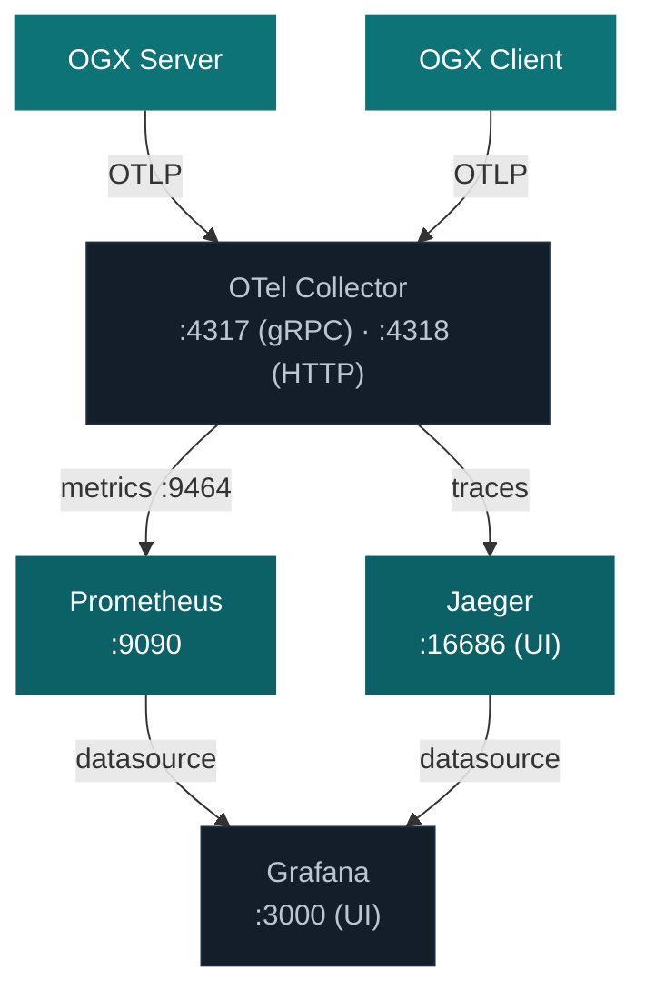

import Tabs from '@theme/Tabs';
import TabItem from '@theme/TabItem';

# Telemetry

OGX uses [OpenTelemetry](https://opentelemetry.io/) for observability. It provides two layers of instrumentation:

- **Auto-instrumentation** (zero-code) captures HTTP requests, database queries, and GenAI calls from supported SDKs (OpenAI, Bedrock, Vertex AI, etc.)
- **Manual instrumentation** emits domain-specific metrics for inference latency, tool execution, vector store operations, and request throughput

Both layers export data through the standard OTLP protocol to any compatible backend (Jaeger, Prometheus, Grafana, MLflow, Datadog, etc.)

## Quick start

Install the OpenTelemetry packages and wrap the server command with `opentelemetry-instrument`:

```sh
# Install OpenTelemetry packages
uv pip install opentelemetry-distro opentelemetry-exporter-otlp
uv run opentelemetry-bootstrap -a requirements | uv pip install --requirement -

# Run with instrumentation
export OTEL_EXPORTER_OTLP_ENDPOINT="http://127.0.0.1:4318"

uv run opentelemetry-instrument \
    --traces_exporter otlp \
    --metrics_exporter otlp \
    --service_name ogx-server \
    -- \
    ogx stack run starter
```

This sends traces and metrics to an OTLP collector on port 4318. The next section shows how to set up the full observability stack.

## Observability stack setup

The repository includes a one-command setup script that deploys Jaeger (traces), an OpenTelemetry Collector, Prometheus (metrics), and Grafana (dashboards) using Docker or Podman.

### Architecture



### Deploy

```bash
# Auto-detects Docker or Podman
./scripts/telemetry/setup_telemetry.sh

# Or specify explicitly
./scripts/telemetry/setup_telemetry.sh --container docker
./scripts/telemetry/setup_telemetry.sh --container podman
```

This creates a `llama-telemetry` container network and starts all four services with pre-provisioned Grafana dashboards.

### Access the UIs

| Service | URL | Credentials |
|---|---|---|
| **Jaeger** (traces) | http://localhost:16686 | N/A |
| **Prometheus** (metrics) | http://localhost:9090 | N/A |
| **Grafana** (dashboards) | http://localhost:3000 | admin / admin |

### Cleanup

```bash
# Replace "docker" with "podman" if applicable
docker stop jaeger otel-collector prometheus grafana
docker rm jaeger otel-collector prometheus grafana
docker network rm llama-telemetry
```

## Client-side instrumentation

You can instrument your client application the same way as the server. This captures outbound HTTP calls to OGX and correlates them with server-side traces.

```bash
export OTEL_EXPORTER_OTLP_ENDPOINT=http://localhost:4318

uv run opentelemetry-instrument \
    --traces_exporter otlp \
    --metrics_exporter otlp \
    --service_name my-ogx-app \
    -- \
    python my_app.py
```

Example `my_app.py`:

```python
from openai import OpenAI

client = OpenAI(
    api_key="fake",
    base_url="http://localhost:8321/v1/",
)

response = client.chat.completions.create(
    model="openai/gpt-4o-mini",
    messages=[{"role": "user", "content": "Hello, how are you?"}],
)
print(response.choices[0].message.content)
```

## Metrics reference

OGX emits metrics across five domains. All metric names use the `ogx` prefix.

### Inference

| Metric | Type | Unit | Description |
|---|---|---|---|
| `ogx.inference.duration_seconds` | Histogram | s | End-to-end inference latency |
| `ogx.inference.time_to_first_token_seconds` | Histogram | s | Time to first content token (streaming only) |
| `ogx.inference.tokens_per_second` | Histogram | - | Output token throughput |

**Attributes:** `model`, `provider`, `stream`, `status`

### Tool runtime

| Metric | Type | Unit | Description |
|---|---|---|---|
| `ogx.tool_runtime.invocations_total` | Counter | 1 | Total tool invocations |
| `ogx.tool_runtime.duration_seconds` | Histogram | s | Tool execution latency |

**Attributes:** `tool_group`, `tool_name`, `provider`, `status`

### Vector IO

| Metric | Type | Unit | Description |
|---|---|---|---|
| `ogx.vector_io.inserts_total` | Counter | 1 | Vector insert operations |
| `ogx.vector_io.queries_total` | Counter | 1 | Vector query/search operations |
| `ogx.vector_io.deletes_total` | Counter | 1 | Vector delete operations |
| `ogx.vector_io.stores_total` | Counter | 1 | Vector stores created |
| `ogx.vector_io.files_total` | Counter | 1 | Files attached to vector stores |
| `ogx.vector_io.chunks_processed_total` | Counter | 1 | Chunks processed across inserts |
| `ogx.vector_io.insert_duration_seconds` | Histogram | s | Insert operation latency |
| `ogx.vector_io.retrieval_duration_seconds` | Histogram | s | Retrieval operation latency |

**Attributes:** `vector_db`, `operation`, `provider`, `status`, `search_mode`

### Request level

| Metric | Type | Unit | Description |
|---|---|---|---|
| `ogx.requests_total` | Counter | 1 | Total HTTP requests by API, method, and status |
| `ogx.request_duration_seconds` | Histogram | s | Request latency by API and method |
| `ogx.concurrent_requests` | Gauge | 1 | Current in-flight requests by API |

**Attributes:** `api`, `method`, `status_code` (counter only)

### Responses API

| Metric | Type | Unit | Description |
|---|---|---|---|
| `ogx.responses.parameter_usage_total` | Counter | 1 | Responses API parameter usage tracking |

## Grafana dashboards

The setup script provisions six pre-built dashboards:

| Dashboard | What it shows |
|---|---|
| **OGX** | Overview: token usage by model, P95/P99 HTTP duration, total requests |
| **Inference Metrics** | Inference latency distribution, time-to-first-token, tokens/sec by model and provider |
| **Request Metrics** | Request rates, error rates, concurrent requests, latency percentiles by API endpoint |
| **Responses Metrics** | Responses API parameter usage patterns |
| **Tool Runtime Metrics** | Tool invocation counts and latency by tool group and name |
| **Vector IO Metrics** | Insert/query/delete rates, chunk processing volumes, operation latency |

### PromQL examples

```promql
# Total input token usage by model
sum by(gen_ai_request_model) (ogx_gen_ai_client_token_usage_sum{gen_ai_token_type="input"})

# Total output token usage by model
sum by(gen_ai_request_model) (ogx_gen_ai_client_token_usage_sum{gen_ai_token_type="output"})

# P95 HTTP server latency
histogram_quantile(0.95, rate(ogx_http_server_duration_milliseconds_bucket[5m]))

# P99 inference duration by model
histogram_quantile(0.99, rate(ogx_inference_duration_seconds_bucket[5m]))

# Tool invocation rate by tool name
rate(ogx_tool_runtime_invocations_total[5m])

# Vector insert throughput
rate(ogx_vector_io_inserts_total[5m])
```

## GenAI message content capture

By default, prompt and response content is **not** captured for privacy. To enable content capture:

```bash
export OTEL_INSTRUMENTATION_GENAI_CAPTURE_MESSAGE_CONTENT=true
```

When enabled, content is emitted as **log events** (e.g., `gen_ai.user.message`, `gen_ai.choice`) with `trace_id` and `span_id` for correlation. Spans carry structured metadata (model, finish reason, token usage) but not the raw text.

### Exporter configuration

<Tabs>
<TabItem value="console" label="Console (debugging)">

```bash
OTEL_INSTRUMENTATION_GENAI_CAPTURE_MESSAGE_CONTENT=true \
uv run opentelemetry-instrument \
    --traces_exporter console \
    --logs_exporter console \
    -- \
    python my_app.py
```

</TabItem>
<TabItem value="collector" label="OTLP Collector (production)">

```bash
export OTEL_EXPORTER_OTLP_ENDPOINT=http://localhost:4318

OTEL_INSTRUMENTATION_GENAI_CAPTURE_MESSAGE_CONTENT=true \
uv run opentelemetry-instrument \
    --traces_exporter otlp \
    --logs_exporter otlp \
    -- \
    python my_app.py
```

</TabItem>
</Tabs>

:::caution Jaeger and logs
Jaeger ingests traces only, not logs. If you set `OTEL_LOGS_EXPORTER=otlp` and point it at Jaeger, logs will be rejected (404). Use an OTel Collector to route logs to a log-capable backend, or use `OTEL_LOGS_EXPORTER=console` for debugging.
:::

## Environment variables

| Variable | Default | Description |
|---|---|---|
| `OTEL_EXPORTER_OTLP_ENDPOINT` | *(none)* | OTLP endpoint URL. Metrics and traces are only exported when set. |
| `OTEL_EXPORTER_OTLP_PROTOCOL` | `http/protobuf` | Transport protocol for OTLP export |
| `OTEL_SERVICE_NAME` | `ogx` | Service name tag on all telemetry data |
| `OTEL_METRIC_EXPORT_INTERVAL` | `60000` | Metric export interval in milliseconds |
| `OTEL_PYTHON_DISABLED_INSTRUMENTATIONS` | *(none)* | Comma-separated list of instrumentors to disable |
| `OTEL_INSTRUMENTATION_GENAI_CAPTURE_MESSAGE_CONTENT` | `false` | Capture prompt/response text as log events |

## Known issues

When OpenTelemetry auto-instrumentation is enabled, both the low-level database driver instrumentor
(e.g. `asyncpg`, `sqlite3`) and the SQLAlchemy ORM instrumentor activate simultaneously. This causes
every database operation to be traced twice - once at the ORM level and once at the raw protocol level.
The driver-level spans expose internal pool mechanics (such as connection health-check queries) that
inflate traces with noise. To prevent this, disable the driver-level instrumentors and rely on the
SQLAlchemy instrumentation alone:

```sh
export OTEL_PYTHON_DISABLED_INSTRUMENTATIONS="sqlite3,asyncpg"
```

:::note
The container image sets this automatically when any `OTEL_*` environment variable is present.
:::

## Related resources

- **[Setup script and configs](/scripts/telemetry/)** - One-command observability stack deployment
- **[OpenTelemetry Documentation](https://opentelemetry.io/)** - Comprehensive observability framework
- **[OpenTelemetry GenAI Semantic Conventions](https://opentelemetry.io/docs/specs/semconv/gen-ai/gen-ai-metrics/)** - Standard GenAI metric naming
- **[Jaeger Documentation](https://www.jaegertracing.io/)** - Distributed tracing visualization
- **[Prometheus Documentation](https://prometheus.io/docs/)** - Metrics storage and querying
- **[Grafana Documentation](https://grafana.com/docs/)** - Dashboard and visualization platform
