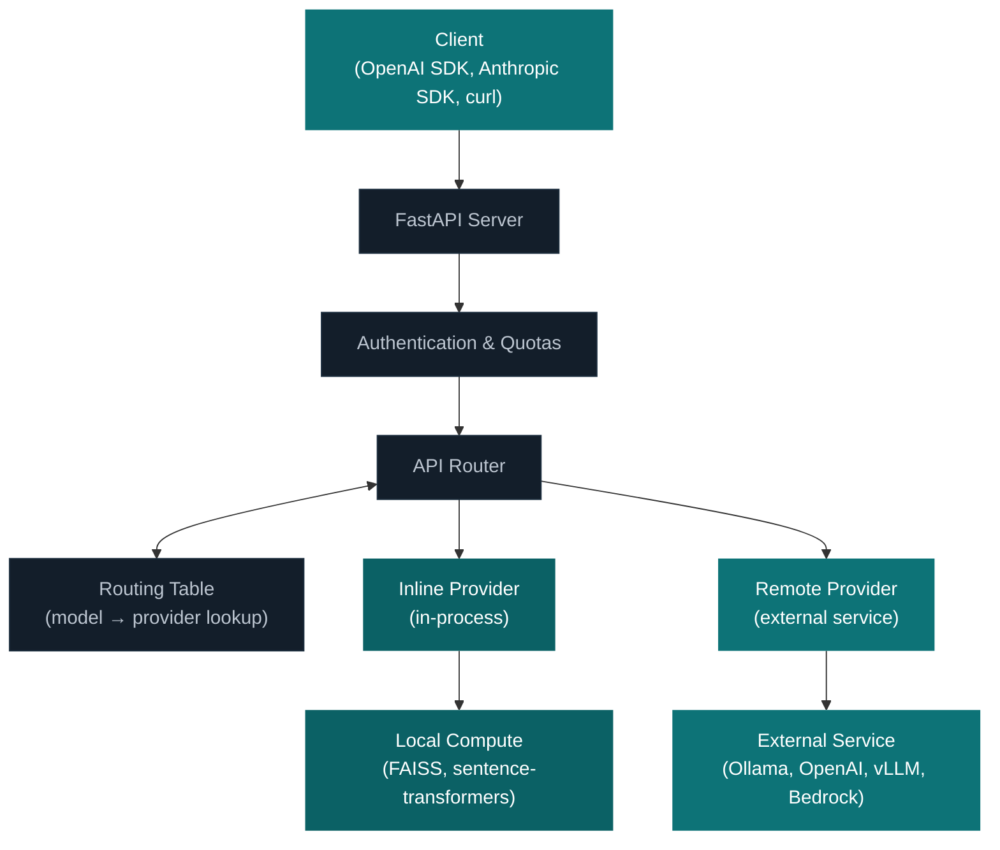

# Architecture

OGX is an AI application server that composes inference, vector stores, file storage, tools, and agentic orchestration behind a unified, OpenAI-compatible API. It is provider-agnostic: the same API works whether the backend is Ollama, OpenAI, vLLM, Bedrock, or dozens of other services.

This is a server-level abstraction, not a library. Your application talks to OGX over HTTP. It doesn't import a Python SDK, doesn't couple to a specific framework, and doesn't manage provider connections. The server handles provider routing, tool execution, guardrail checks, and multi-turn orchestration. Your application makes HTTP calls.


## API Surface

OGX exposes three API families through a single server:

- **OpenAI API** — Chat Completions, Responses, Embeddings, Vector Stores, Files, Batches, Models, Conversations. This is the primary API surface. Any OpenAI SDK works.
- **Anthropic API** — Messages endpoint (`/v1/messages`). An adapter that translates Anthropic-format requests to the inference API. Teams using the Anthropic SDK can point it at OGX without code changes. See the [Messages provider docs](/docs/providers/messages/) for current limitations.
- **Native APIs** — Connectors, Tools, and File Processors. These extend beyond the OpenAI and Anthropic specs for capabilities like MCP tool registration and document ingestion.

The Responses API (`/v1/responses`) deserves special attention. It implements server-side agentic orchestration: when a model requests tool calls, the server executes them (file search, web search, MCP tools), feeds results back, and repeats until the model produces a final response. Your application sends one request and gets back a complete, tool-augmented answer. This orchestration runs on the server, not in your application code.

## Two Packages

The codebase is split into two packages:

- **`ogx-api`** - Lightweight package with API protocol definitions, Pydantic data types, and provider specs. No server code. Third-party providers depend only on this.
- **`ogx`** - The server: provider resolution, routing, storage, CLI, and all built-in providers.

## Request Flow



**Example**: `POST /v1/chat/completions` with `model: "ollama/llama3.2:3b"`:

1. FastAPI dispatches to the inference router
2. `InferenceRouter` calls `routing_table.get_provider_impl("ollama/llama3.2:3b")`
3. The routing table finds the model belongs to the `ollama` provider
4. The router delegates to the Ollama provider's `openai_chat_completion()` method
5. The provider forwards to the Ollama server and streams the response back

## Provider Architecture

Providers come in two types:

| Type | Example | How it works |
|------|---------|--------------|
| **Inline** (`inline::`) | `inline::faiss`, `inline::sentence-transformers` | Runs in the OGX process |
| **Remote** (`remote::`) | `remote::ollama`, `remote::openai` | Adapts an external service |

Each provider declares which API it implements, its config class, and its dependencies. The provider registry (`src/ogx/providers/registry/`) lists all available providers per API.

### Auto-Routing

Many APIs use automatic routing so multiple providers can serve different resources through the same API:

| Routing Table | Router | Purpose |
|--------------|--------|---------|
| `Api.models` | `Api.inference` | Route to correct inference provider per model |
| `Api.vector_stores` | `Api.vector_io` | Route to correct vector store provider |
| `Api.tool_groups` | `Api.tool_runtime` | Route to correct tool runtime |

This means you can have Ollama serving one model and OpenAI serving another, both accessible through the same `/v1/chat/completions` endpoint.

## Configuration

A run config YAML defines everything about a running instance:

```yaml
version: 2
distro_name: starter
providers:
  inference:
    - provider_id: ollama
      provider_type: remote::ollama
      config:
        base_url: ${env.OLLAMA_URL:=http://localhost:11434/v1}
    - provider_id: openai
      provider_type: remote::openai
      config:
        api_key: ${env.OPENAI_API_KEY}
```

Key features:
- **Environment variable substitution**: `${env.VAR:=default}`
- **Conditional providers**: `${env.API_KEY:+provider_id}` enables a provider only when a variable is set
- **Multiple providers per API**: both Ollama and OpenAI can serve inference, each handling different models

## Distributions

A distribution is a pre-configured run config for a target environment. Think Kubernetes distributions (AKS, EKS, GKE) - the API stays the same, each distribution wires different backends.

| Distribution | Use case | Container Image | Documentation |
|--------------|----------|-----------------|---------------|
| `starter` | General purpose, supports most providers | [`llamastack/distribution-starter`](https://hub.docker.com/r/llamastack/distribution-starter) | [Starter Guide](/docs/distributions/self_hosted_distro/starter) |
| `postgres-demo` | Starter with PostgreSQL storage | [`llamastack/distribution-postgres-demo`](https://hub.docker.com/r/llamastack/distribution-postgres-demo) | — |
| `nvidia` | NVIDIA-specific hardware optimizations | — | [NVIDIA Guide](/docs/distributions/self_hosted_distro/nvidia) |
| Custom | Build your own by creating a custom `config.yaml` | — | [Building Custom Distributions](/docs/distributions/building_distro) |

## Storage

OGX persists state (registered models, conversation history, vector stores) using pluggable storage backends:

| Backend | Use case |
|---------|----------|
| SQLite | Default, single-node development |
| PostgreSQL | Production deployments |
| Redis | Multi-node caching |

Storage is configured in the run config and shared across all providers.
