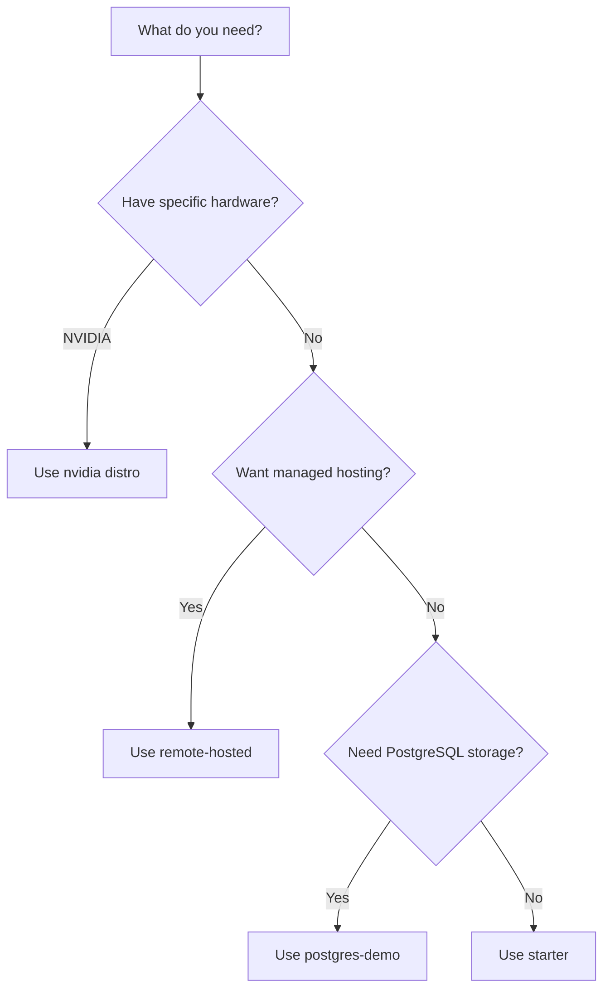

# Available Distributions

| Distribution | Use Case | Inference | Container Image |
|-------------|----------|-----------|-----------------|
| `starter` | General purpose, prototyping, production | Ollama, OpenAI, vLLM, Bedrock, and more | [`llamastack/distribution-starter`](https://hub.docker.com/r/llamastack/distribution-starter) |
| `postgres-demo` | Starter with PostgreSQL storage | Same as starter | [`llamastack/distribution-postgres-demo`](https://hub.docker.com/r/llamastack/distribution-postgres-demo) |
| `nvidia` | NVIDIA NeMo Microservices | NVIDIA NIM | — |
| Custom | Your own provider mix | Any supported provider | — |

## Starter (Recommended)

The starter distribution works for most use cases. It includes all providers and auto-enables them based on available environment variables:

```bash
uv run ogx stack run starter
```

It supports local inference (Ollama), cloud providers (OpenAI, Bedrock, Azure, etc.), and everything in between. See the [Starter Guide](self_hosted_distro/starter) for details.

## PostgreSQL Demo

A variant of the starter distribution pre-configured with PostgreSQL storage instead of SQLite. Suitable for production-like deployments and demos:

```bash
docker run -it \
  -p 8321:8321 \
  -v ~/.llama:/root/.llama \
  -e POSTGRES_HOST=host.docker.internal \
  -e POSTGRES_PORT=5432 \
  -e POSTGRES_DB=ogx \
  -e POSTGRES_USER=ogx \
  -e POSTGRES_PASSWORD=ogx \
  ogx/distribution-postgres-demo
```

## NVIDIA

Optimized for NVIDIA NeMo Microservices. See the [NVIDIA Guide](self_hosted_distro/nvidia).

## Passthrough

A minimal distribution that forwards requests to a remote OGX server. See the [Passthrough Guide](self_hosted_distro/passthrough).

## Remote-Hosted

Some partners host OGX endpoints that you can connect to directly. See [Remote-Hosted Distributions](./remote_hosted_distro/) for available options.

## Custom

Build your own distribution when you need a specific provider mix. See [Building Custom Distributions](./building_distro).


